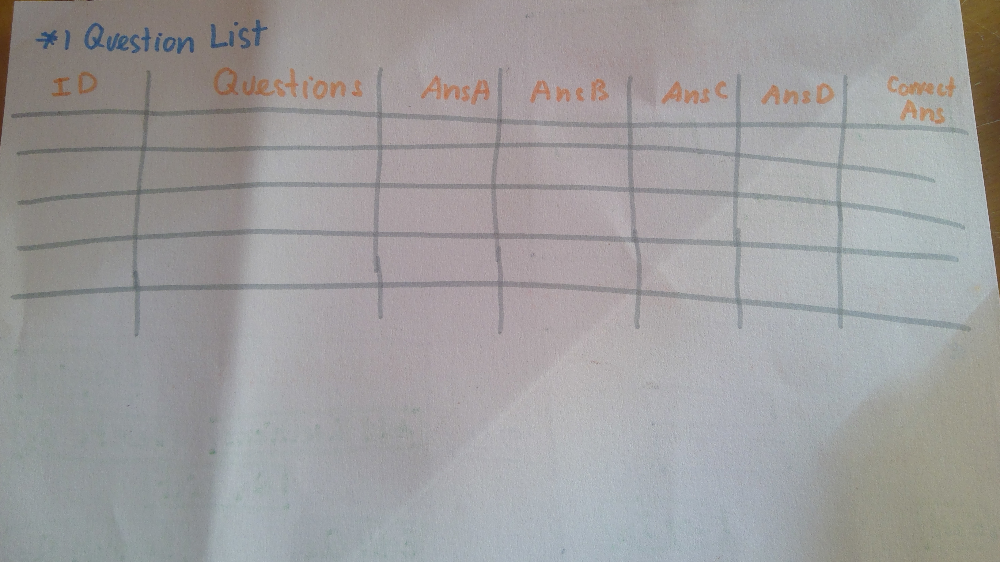
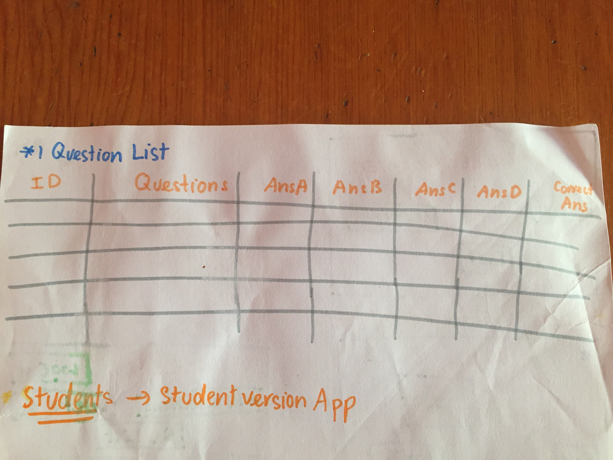
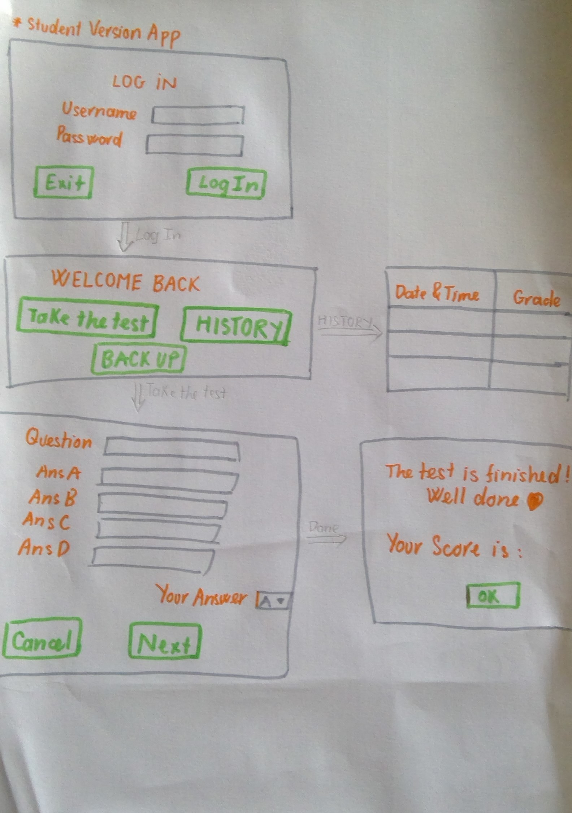
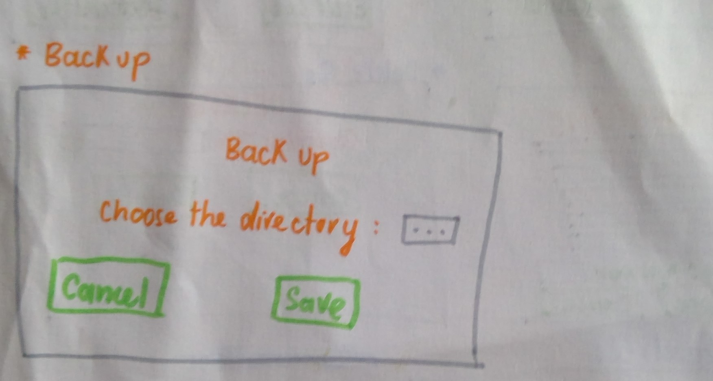
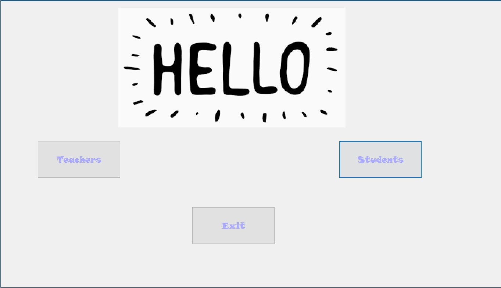
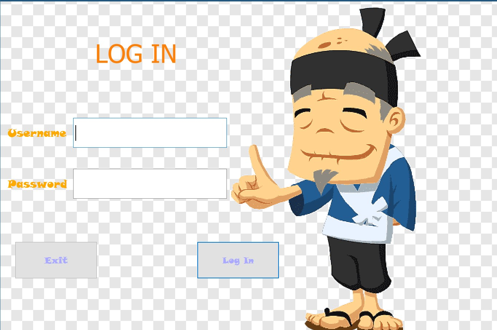
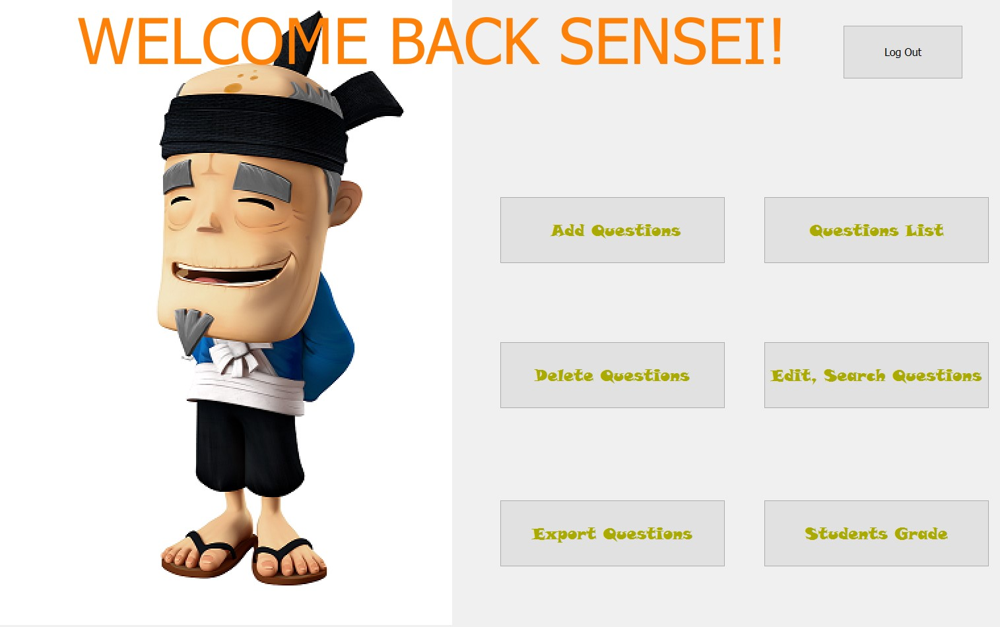
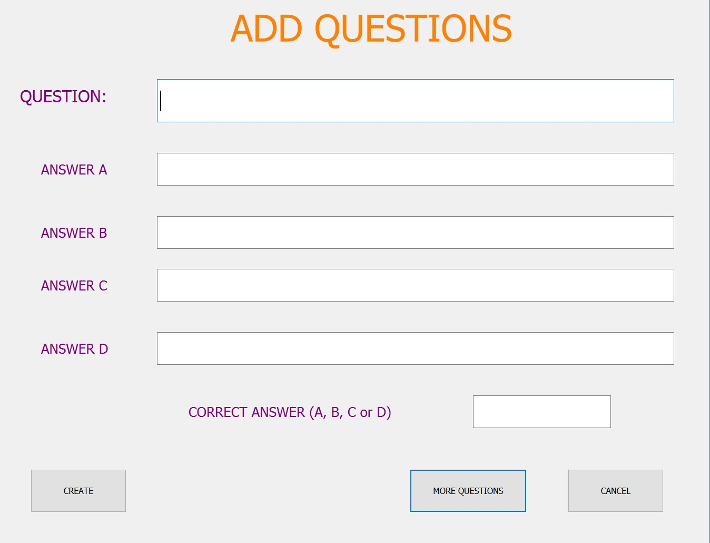
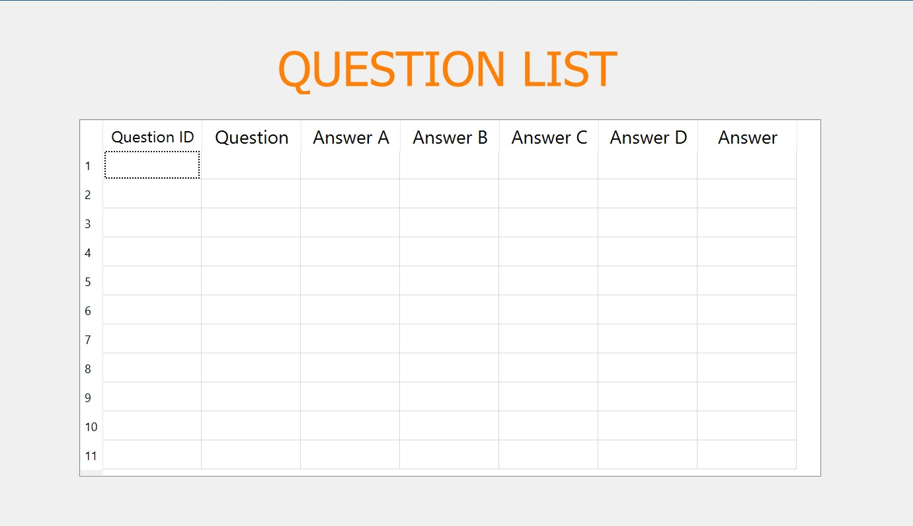
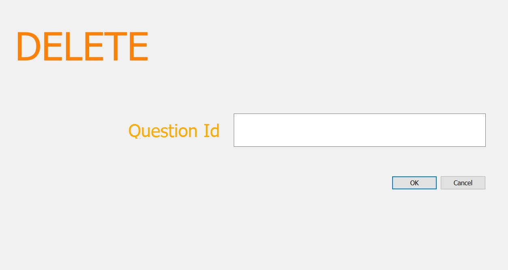

  **Fig1.** The initial design of the Food Management App. These picutes show the detail of the background of each function. These were made based on the success criteria
  

  **Fig3.** The welcome ui design window containing options for users to select whether they are teachers or students.
  
  

  **Fig4.**  The login ui design window containing username and password input only due to the teacher can only access it by herself.
  
   

  **Fig5.**  The list of functions window shows all the functions that the user can access through the program. Also, with the log out button, the user can log out and quit the program immediately.
  
  

  **Fig6.**  The add new questions ui window allows user to add a single or multiple questions for the tests. After creating, the questions will be save in the database and shown in the list of questions table.
  
  

  **Fig7.**  All the created questions will be shown in the table. Also the anwers and correct answers are listed in this area.
  
  

  **Fig8.**  The delete function will delete the question inputted and all of its answers in the table of questions and datatbase.
  
  
  
  
  
  
  
  
  
