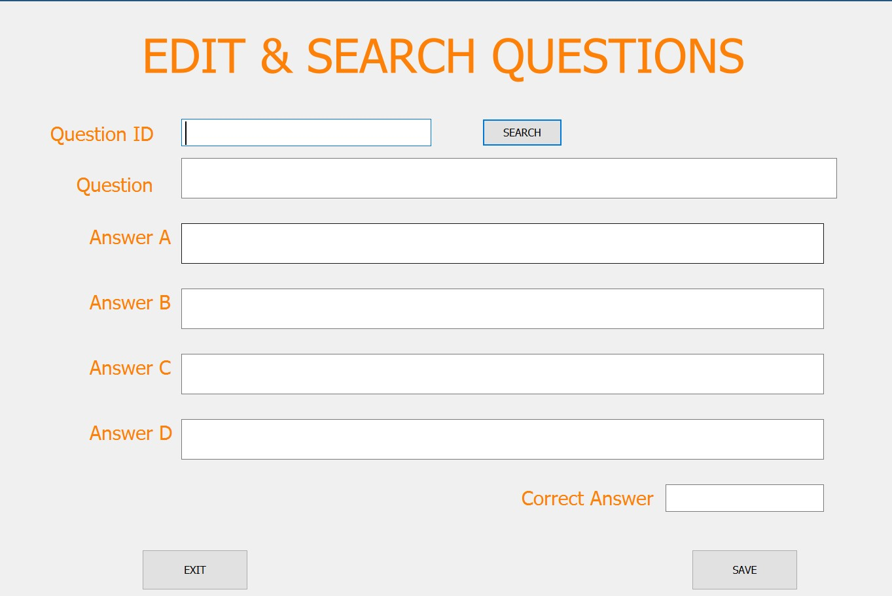
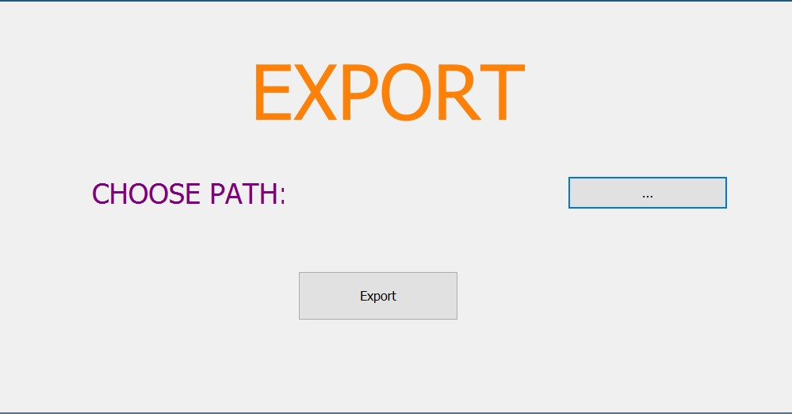
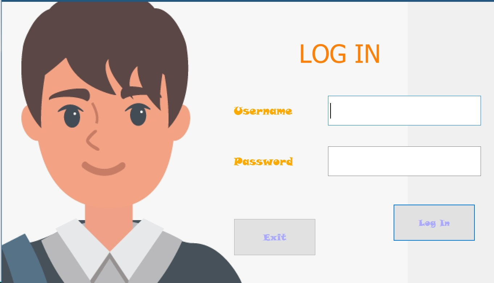
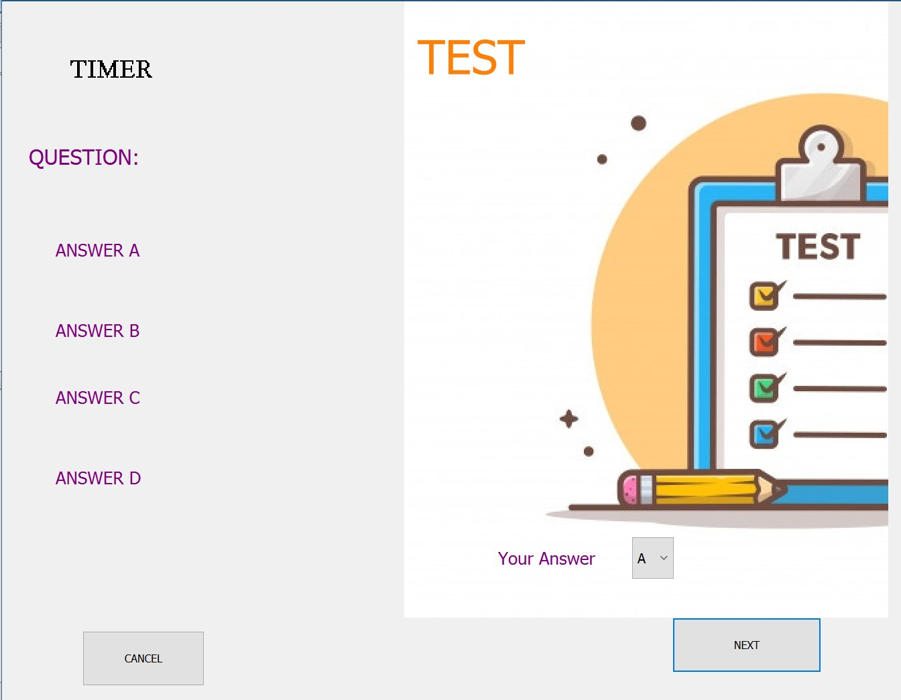
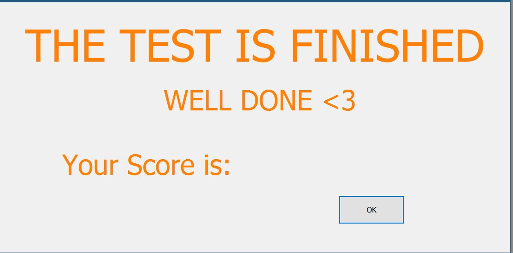
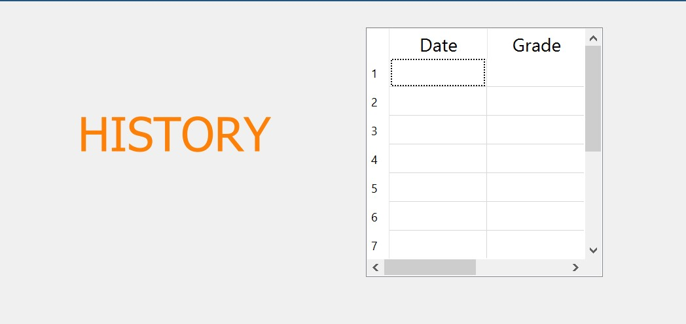

  **Fig1.** The initial design of the Food Management App. These picutes show the detail of the background of each function. These were made based on the success criteria
  

  **Fig3.** The welcome ui design window containing options for users to select whether they are teachers or students.
  
  --------------------------------------------------------------------
  
  **TEACHER APP**
  
  

  **Fig4.**  The login ui design window containing username and password input only due to the teacher can only access it by herself.
  
   

  **Fig5.**  The list of functions window shows all the functions that the user can access through the program. Also, with the log out button, the user can log out and quit the program immediately.
  
  

  **Fig6.**  The add new questions ui window allows user to add a single or multiple questions for the tests. After creating, the questions will be save in the database and shown in the list of questions table.
  
  

  **Fig7.**  All the created questions will be shown in the table. Also the anwers and correct answers are listed in this area.
  
  

  **Fig8.**  The delete function will delete the question inputted and all of its answers in the table of questions and datatbase.
  
  

  **Fig9.** This is a multipurpose windows as it features both searching and editting the information of the questions created by the users.
  
  

  **Fig10.** The export function helps teacher to export all the questions that they created. Then they can use this file to send to their students for test purpose.
  
 --------------------------------------------------------------------
  
  **STUDENT APP**
  
  

  **Fig11.**  The login ui design window containing username and password input only due to the students can only access it by thenselves.
  
  

  **Fig13.** The window will show the test for students with questions, answer chose and timer.
  
  

  **Fig14.**  The finish window notifies the students that they have finished the test and shows the score of the test.
  
  

  **Fig15.**  The history table will show the date and time the tests taken and the grade for each test.
  
  ### Expected input and output
  
  #|Function|INPUT|OUTPUT
---|---|---|---
1| Add Questions | Questions, Answer Choice and Correct Answers|Data in the Databse file and in the questions data table
2| Edit and Search Questions | Question ID | All the properties of the questions and the new data (if the information is editted) will be saved in the database file and the question list table.
3| Delete Question | Question ID | All the properties of the questions will be deleted from the database file and also in the questions table.
4| Export | Directory | The database file will be saved in the inputted directory
5| DELETE FOOD | The name of the food | All the properties of the food included name of the food will be deleted from the database file and also the food data table

  ### Testing plan
  
  Due to the output data can be shown after using the functions right in the app, so that we can test the program by using using the program and look at the place where the output will be. This can be done right after finishing the code and by the user in the progress of using the program.
  
  
  
  
  
  
  
  
  
  
  
  
  
  
