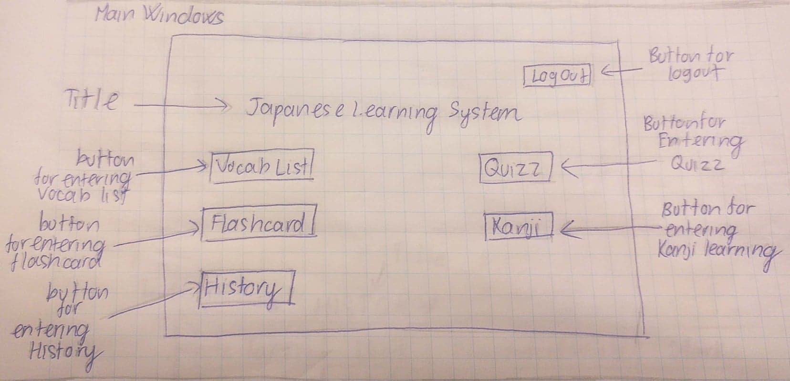
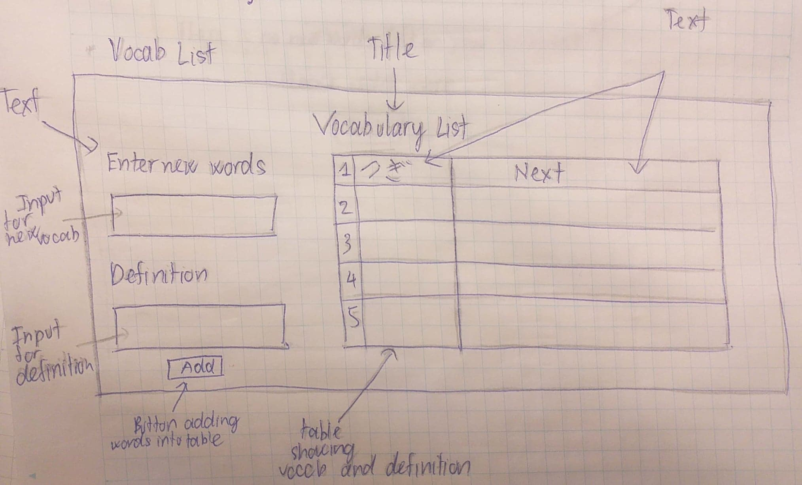
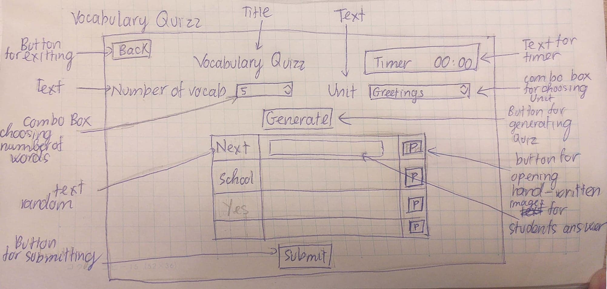
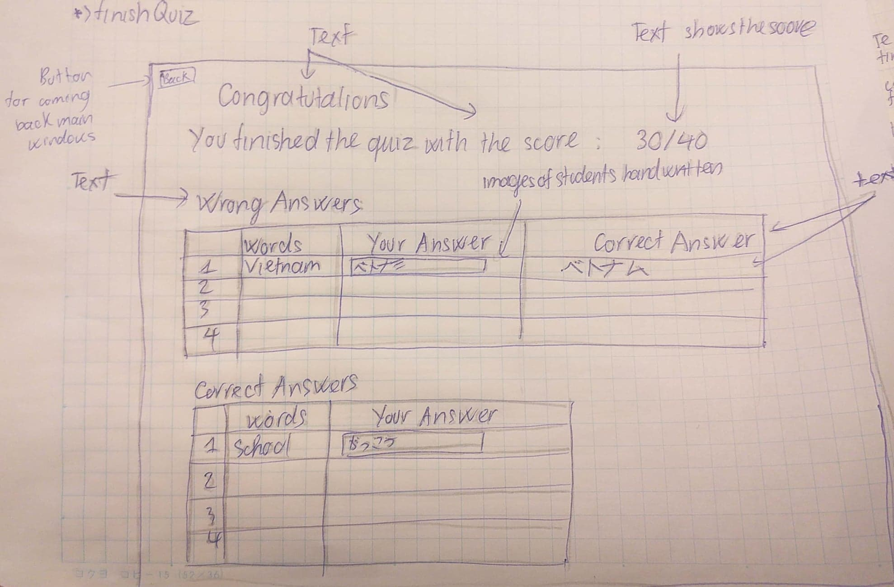
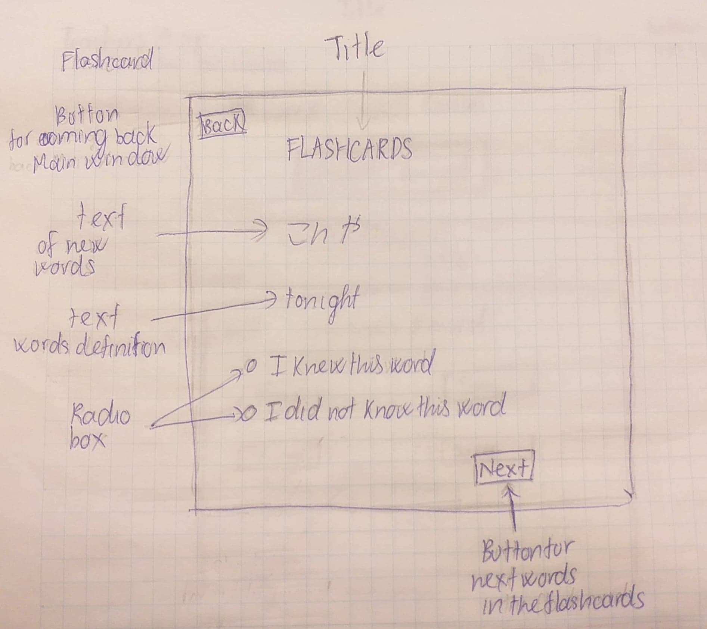
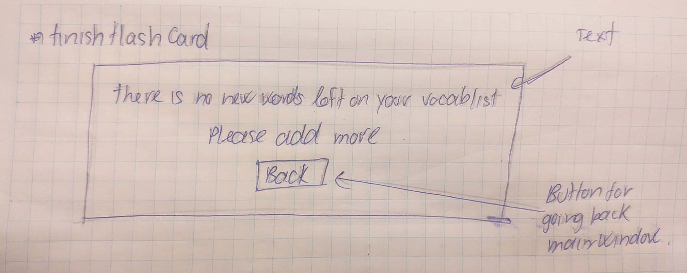
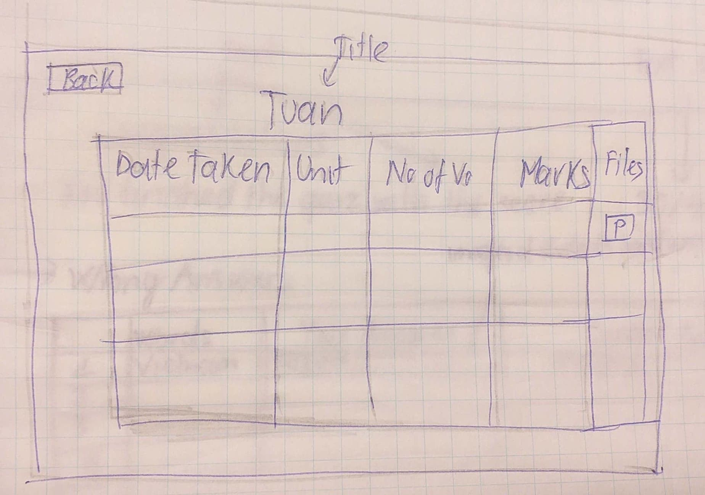

## GENERAL VIEW:

  **Fig1.** The overview diagram of the apps

## INTERFACE

### Students App

  **Fig1.** The UI Design of the Log In Windows of the Program.
  

  **Fig2.** The UI Design of the Main Windows with all the functions of the app

  **Fig3.** The UI Design of the Vocabulary List.
  

  **Fig4.** The UI Design of the Vocabulary Quizz.

  **Fig5.** The UI Design of the windows showing the results of students' quizzes.

  **Fig6.** The UI Design of the flashcard windows.

  **Fig7.** The UI Design of the windows if the students finish all the new words in the flash cards.
 
 

  **Fig8.** The UI Design of the windows showing the records of students

### Teachers App
  
 

  **Fig9.** The UI Design of the log In Windows
 
 

 **Fig10.** The UI Design the Main Windows
 
  

  **Fig11.** The UI Design of the students list
 
   

  **Fig12.** The UI Design of the students' record
 
 
  
 
 
