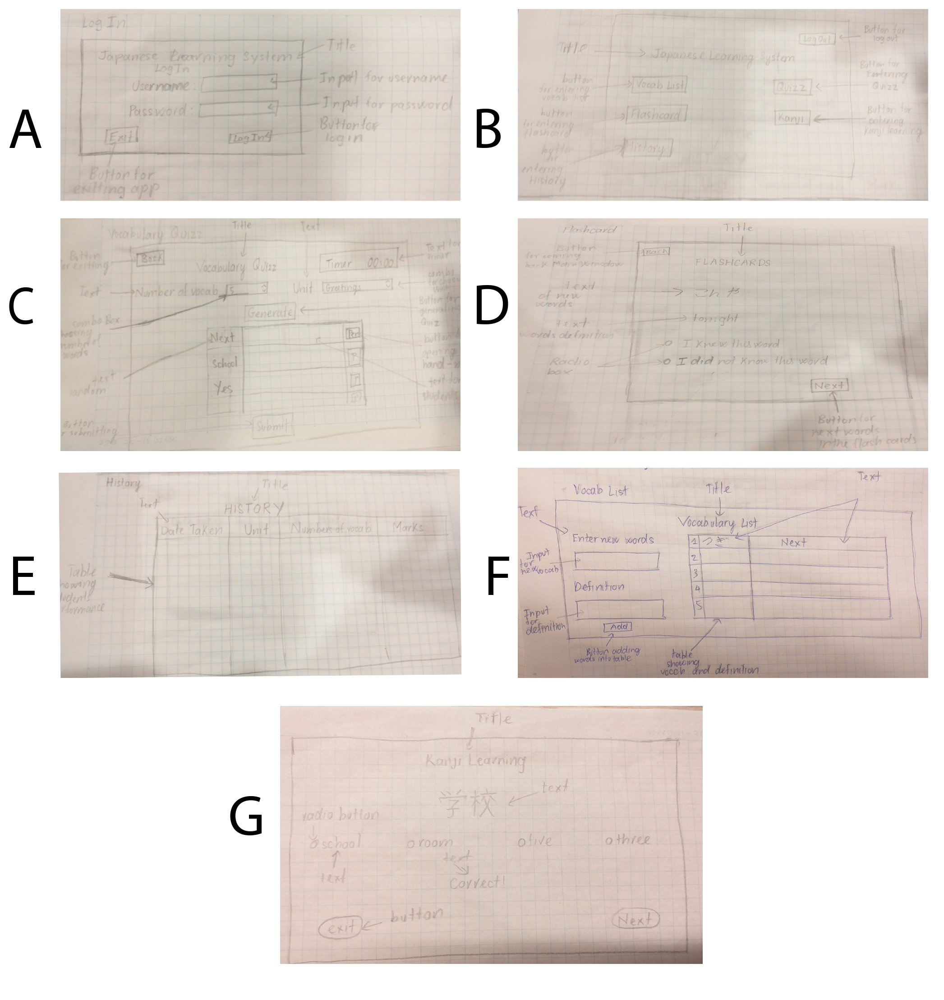
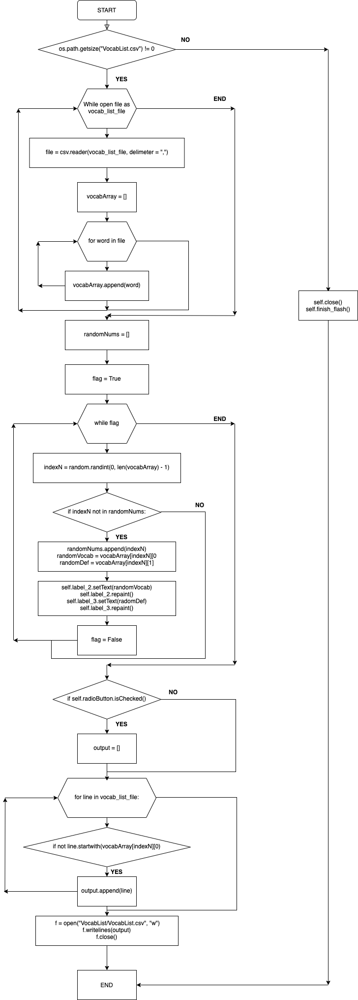

## GENERAL VIEW:

  **Fig1.** The overview diagram of the apps
 
 

  **Fig2.** The overview diagram of the apps
 

## INTERFACE

### Students App

**Sketched Desgin**

 

  **Fig3.** A. Log In Window; B. Students Main Window; C. Vocab Quizz Window; D. Flashcard Window; E. History Window; F.Vocab List Window; G.Kanji Learning Window
  
**Final GUI**
 
  

  **Fig4.** A. Log In Window; B. Students Main Window; C. Vocab Quizz Window; D. Flashcard Window; E. Kanji Window; F. History Window; G. Vocabulary List

### Teachers App

**Sketched Design**
  
 

  **Fig5.** A. Log In Window; B. Teacher Main Window; C. Students List; D. Student's History

**Final GUI**
 
 
 
 **Fig6.** A. Log In Window; B. Teacher Main Window; C. Students List; D. Student's History
  
  ## Flow Chart
  
  ### Flash Card window
   

  **Fig7.** Here is the flowchart of the flashcard window. In the success criteria, all the vocabualary in the vocabulary list will be shown in the flashcard window. The flash card window will read the file line by line and randomly take the data from the file and then display it inside the window. In the flowchart, rhombus represents the conditions; hexagon used for loop; rectangle is for process or actions;
  
  ### Generating random quizz
   

  **Fig7.** Here is the flowchart of generating random quizzes function, which is inside the Vocab Quizz windows. It will generate random with the chosen number of quiz and topic. It is one of the key success criteria for the program: `generating random quizzes`. 
  .In the flowchart, rhombus represents the conditions; hexagon used for loop; rectangle is for process or actions;
  
  ## Testing Plan
  
  
|#|Function|INPUT/INSTRUCTIONS|OUTPUT|
|:---|:---:|:---:|:---:|
|1|Log In|Enter the Username and Password into two boxes, then press 'Log In' button|If the username or password is correct, enter the app; Otherwise, the inputted username and password box will be emptied foe users to enter again|
|2|Vocab Quizz generate randomly quizzes|Choosing the number of vocabs for the quiz and the unit; For eg, 5 vocabs and Unit Greetings. Then press generate|There will be 5 randoms English words appear in the first column of the table for example: Hello, Good morning, Good afternoon, Nice to meet you, Good bye. Also there will be 5 buttons at the last coloumn of the table apears for entering hand-written.|
|3|Students' Answers are hand-written|Press at the button in the last coloumn of the table after generating|There will be a box appear to write on it. Then, the handwritten will be converted into image and added into the second coloum of the table|
|4|Check students' answer automatically|If the timer still have time, press the submit button if finish. If not, no need actions|There will be a window appear showing the score of the students, for example if students have 25 correct quizzes over 30, the window will print out 25/30. There also two tables, one for the correct answer and one for the wrong answers. For the wrong answer, it will show the English, iamges of students' answer and correct answer. For example, Hello, 'こんにちみ’、こんにちは. For the correct questions, the table will simply show the quiz and the students' answer|
|5|Vocab is sorted by topic|Choose the unit in the Quizz Windows, for example: Greetings then press Generate|The English words in the first coloumn are related to Greetings for instance: Hello, Good Bye, Nice to meet you|
|6|The wrong vocabulary answer in the quiz will be added to the vocabulary list|Open the Vocab list|The wrong answers and its definition will appear in the table inside the window|
|7|The vocabulary and its definition can be added by students|New words and their definition. For example: こんにちは and its definiton: Hello. Then press Add|The words and the definition will be added into the table on the right side|
|8|The wrong vocab answer quiz can be added into the flash card|Open the flashcard windows|The users will see the Japanese words during the time of doing the flashcards|
|9|The vocabulary will be deleted if the students' answer for next time or the students know the word in the flashcard|Doing the quizz one more time, with the same topic. And this time, do all the quizz correct. Or Open the flashcard, check the box "I know this word"|The word will disappear from the table of vocabulary list|
|10|History Windows|Doing quizz. For example: 5 vocabs, Unit: Greetings|The detail of the quizzes. Eg: "Number of Vocabs": 5, "Date taken: " 20/11/2020, "Unit": Greetings, "Marks": 4|
|11|Students' Record on Teacher App|Press on the button with the name of students on it. Eg "Tuan"|There will be a windows look like history windows in the students app, all the records should be the same on the Tuan's students app.|

 
